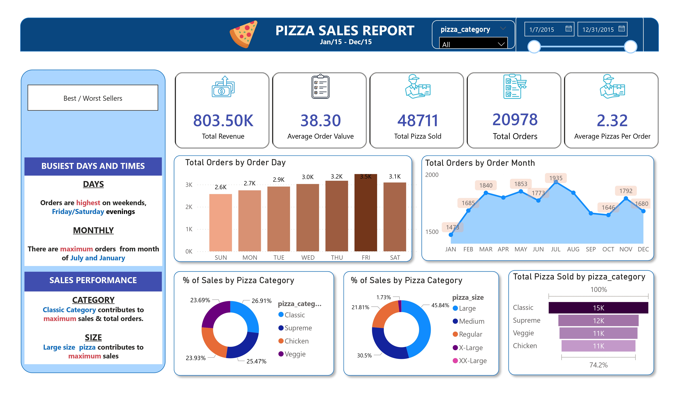

# 🍕 Project 1: Pizza Sales Analysis & Interactive BI Dashboard

Excited to share my latest Pizza Sales Dashboard project built using SQL and Power BI! 

I recently completed this end-to-end Business Intelligence project, where I transformed raw sales data into an interactive dashboard that provides meaningful insights for decision-making.

---

## 🎥 Project Demonstration & Overview

<table>
  <tr>
    <td align="center" width="50%">
      <b>Dashboard Preview</b>  
      
    </td>
    <td align="center" width="50%">
      <b>Video Walkthrough</b>  
      <video width="100%" controls>
        <source src="./Dashboards/video.mp4" type="video/mp4">
        Your browser does not support the video tag.
      </video>
    </td>
  </tr>
</table>

🔗 [View original video post directly on LinkedIn](https://www.linkedin.com/feed/update/urn:li:ugcPost:7482067263232049153)

---

## 💡 Key Business Insights

* **Top Sellers by Size:** Large-size pizzas generated the highest sales.
* **Top Category:** The Classic category contributed the most overall sales.
* **Peak Ordering Times:** Weekend evenings (especially Friday and Saturday) recorded the highest number of orders.

---

## 🛠️ Project Workflow & Technical Tasks

Throughout this project, I worked on:

* 🔹 Importing and managing data using **SQL**.
* 🔹 Writing SQL queries to generate key business KPIs.
* 🔹 Connecting the SQL Database directly with **Power BI**.
* 🔹 Cleaning and transforming data using **Power Query**.
* 🔹 Creating interactive KPI cards and comprehensive dashboards.
* 🔹 Visualizing daily and monthly sales trends.
* 🔹 Analyzing sales by pizza category and size.
* 🔹 Identifying the best and worst-selling pizzas.
* 🔹 Adding business insights and navigation buttons for a better user experience.

---

## 🚀 Skills Strengthened

This project helped me strengthen my skills in:
**SQL** | **Power BI** | **Power Query** | **Data Cleaning** | **Data Modeling** | **DAX** | **Data Visualization**

...while also improving my ability to turn raw data into actionable business insights.

---

## 📂 Project Structure & Files

* **`Dashboards/`** — Exported visual reports and snapshots:
  * [`Home-DashBoard.jpg`](./Dashboards/Home-DashBoard.jpg) — Main overview page.
  * [`Best_Worst_Sellers.jpg`](./Dashboards/Best_Worst_Sellers.jpg) — Breakdown analysis of top/bottom performing items.
  * [`video.mp4`](./Dashboards/video.mp4) — Project walkthrough recording.
* **`sql/`** — Database scripts and queries:
  * [`SqlQuery1.sql`](./sql/SqlQuery1.sql) — SQL scripts used for data cleaning and KPI generation.
* **`pizza_sales.csv`** — The raw source dataset.
* **`project1.pbix`** — The native Power BI template file.

---

*A big thank you to everyone who shares valuable learning resources with the data community. Looking forward to building more data analytics and business intelligence projects!*

**[⬅️ Back to Main Portfolio README](../README.md)**
