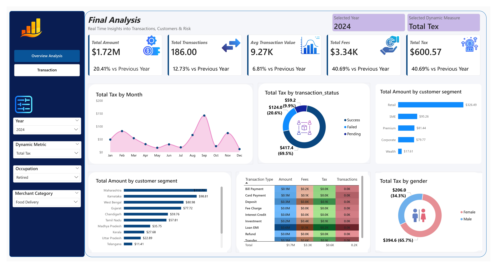
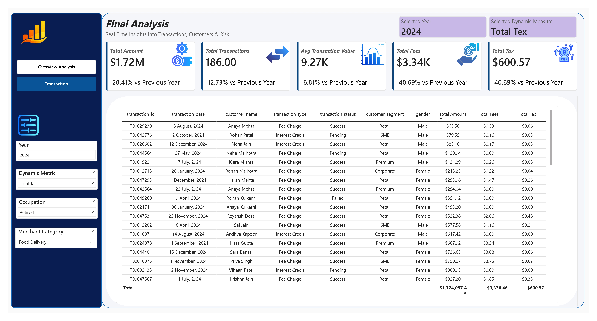

# Project 2: Finance Analytics Dashboard & Business Intelligence Solution

An end-to-end business intelligence analytics project built to monitor and analyze overall financial transactions, customer behavior, fees, taxes, and transaction performance across different business segments and regions.

---

## Project Demonstration & Overview

<table>
  <tr>
    <td align="center" width="33%">
      <b>Overview Analysis View</b>  
      
    </td>
    <td align="center" width="33%">
      <b>Transaction Insights View</b>  
            
    </td>
     </tr>
</table>

🔗 [View original video post directly on LinkedIn](https://lnkd.in/p/g7izVc6i)

---

## Business Requirements & Objectives

The management team faced challenges in tracking overall transaction growth, monthly amounts, success rates, state-wise performance, and customer segment contributions. This centralized analytical solution enables stakeholders to:
* Monitor real-time KPIs (Total Amount, Total Transactions, Avg Transaction Value, Total Fees, Total Tax).
* Identify high-performing customer segments and top-performing states.
* Analyze transaction patterns, seasonal trends, and operational efficiency.
* Track operational fees, taxes, and customer demographics (Gender, Occupation).
* Filter dynamically by **Year**, **Dynamic Measure**, **Occupation**, and **Merchant Category**.

---

## 📊 Core Dashboard Visualizations & KPIs

### Main KPIs Tracked:
1. **Total Amount:** Total transaction amount processed with Year-over-Year (YoY) growth comparison.
2. **Total Transactions:** Total volume of transactions performed with annual volume changes.
3. **Average Transaction Value:** Average transaction amount metric.
4. **Total Fees:** Aggregate operational fees collected.
5. **Total Tax:** Total tax generated across all transactions.

### Analytical Charts & Breakdown Views:
* **Total Amount by Month (Line/Area Chart):** Analyzes seasonal trends and transaction spikes throughout the year.
* **Total Amount by Transaction Status (Donut Chart):** Compares Success, Failed, and Pending statuses to measure operational efficiency.
* **Total Amount by Customer Segment (Horizontal Bar Chart):** Breaks down contributions from Retail, Premium, SME, Corporate, and Wealth segments.
* **Total Amount by State (Horizontal Bar Chart):** Compares regional performance across states.
* **Transaction Type Analysis (Matrix / Heatmap Table):** Measures Amount, Fees, Tax, and Transaction Count across categories like Bill Payments, Card Payments, Deposits, Loans, and Transfers.
* **Total Amount by Gender (Donut Chart):** Analyzes demographic participation between Male and Female customers.
* **Detailed Grid View:** Provides drill-down capabilities for underlying individual transaction records and metadata.

---

## Skills & Tools Utilized

* **Data Visualization & BI:** Power BI, DAX Measures, Power Query
* **Data Architecture:** CSV Data Processing, Relational Modeling, Data Ingestion
* **Business Analysis:** KPI Tracking, Financial Trend Analysis, Risk & Segment Evaluation

---

## 📂 Project Structure & Files

* **`Dashboards/`** — Exported visual reports and snapshots:
  * [`OverViewAnalysis.jpg`](./Dashboards/OverViewAnalysis.jpg) — Overview analysis grid report.
  * [`Transaction.jpg`](./Dashboards/Transaction.jpg) — Detailed financial transaction breakdown dashboard.
  * [`video.mp4`](./Dashboards/video.mp4) — Project walkthrough recording.
* **`finance_transactions.csv`** — Raw primary transaction dataset.
* **`customers.csv`** — Customer demographic and profile dataset.
* **`Finance Analysis.pbix`** — Native Power BI project file.
* **`ProjectRequirements.pdf`** — Detailed documentation of project scope and business specs.

---

*Looking forward to building more advanced data analytics and business intelligence solutions!*

**[⬅️ Back to Main Portfolio README](../README.md)**
